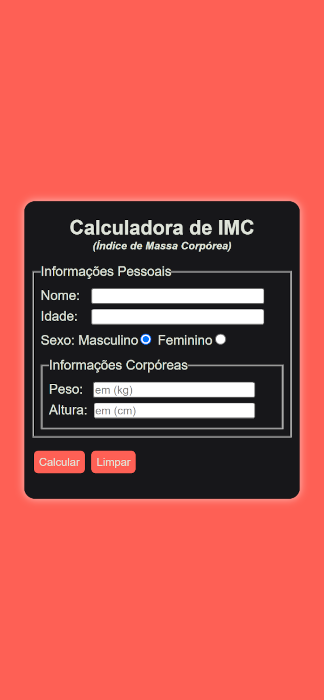

# Calculadora de IMC

Nesse mini projeto criei uma calculadora de Indice de Massa Corpórea (IMC), utilizei HTMl5 apenas para marcações e divisões de classes, já no CSS3 fiz uso da filosofia Mobile Frist através de Media Queries conforme pode ser compreendido no arquivo "estilos/media-query.css".
 

Quanto ao Javascript decidi utilizar funções aninhadas para inicialmente validar os dados vindos dos input's "idade" e "peso" para que a aplicação web não aceitasse a inserção de valores negativos nem iguais a zero, funções "verifidade()" e "verifpeso()". Após isso iniciei os trabalhos da função principal da aplicação chamada "calc()", na qual faço uso da fórmula do cálculo de IMC para entregar o resultado na tela do usuário. Por fim, criei uma última função chamada "limpar()" que além de limpar o formulário, elimina o conteúdo da resposta na variável "resp" e atribui o foco do cursor novamente no campo nome.

<a href="https://developeryago.github.io/project-calculadora-imc/">Link do Projeto</a> 
 
 

